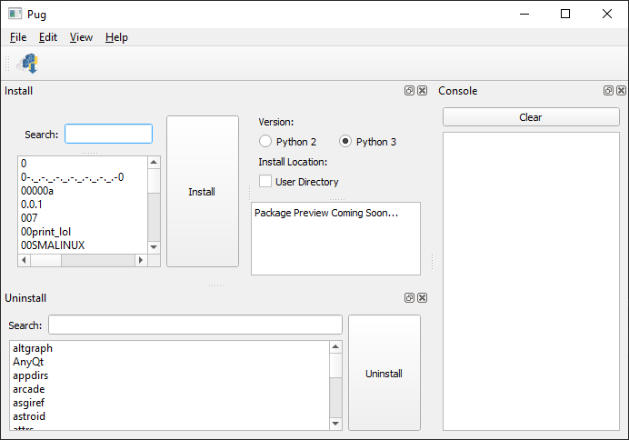

# Pug

A cross-platform, free and open source GUI for PIP.



## Features

- Install packages from PyPi
- Option to install package for current user
- Option to install package for either Python 2 or 3
- Uninstall packages
- Console to view progress

## Installing

At this time, Pug is a source only distribution.

1. Make sure [Python](https://www.python.org/downloads) is installed. Both Python 3.7 and 3.8 have been tested.

2. Obtain the source code by cloning this repository and extract the files.

3. Open a shell (on Windows the Command Prompt or PowerShell) in the top level directory of the extracted Pug source tree.

4. On Linux and MacOS, run the following command:
   
   ```bash
   pip3 install -r requirements.txt
   ```
   
   On Windows, run the following command:
   
   ```bash
   pip install -r requirements.txt
   ```

## Running

To run Pug:

1. Open a shell in the top level directory of Pug.

2. On Linux and MacOS, run the following command:
   
   ```bash
   python3 -i main.py
   ```
   
   On Windows, run the following command:
   
   ```bash
   python -i main.py
   ```

### Another Method of Running Random Group Generator on Windows

1. Navigate to the top level directory of Pug.

2. Double click on `main.py`.

## Todo

- [ ] Create an icon/logo
- [ ] Improve performance
- [ ] Create ``Upgrade Package``
- [ ] Create ``Install Requirements``
- [ ] Preview Package (in ``Install Package`` and ``Uninstall Package``)
- [ ] Create more styles
- [ ] Write a plugin system

## Contributing

Pug is a work in progress and is no where near ready for version 1.0.0. Contributions and pull requests are welcome.

## Help

For any bugs, feature requests or support, please open an issue on Gitlab.

## License

Pug is released under the General Public License v3 (GPLv3).
